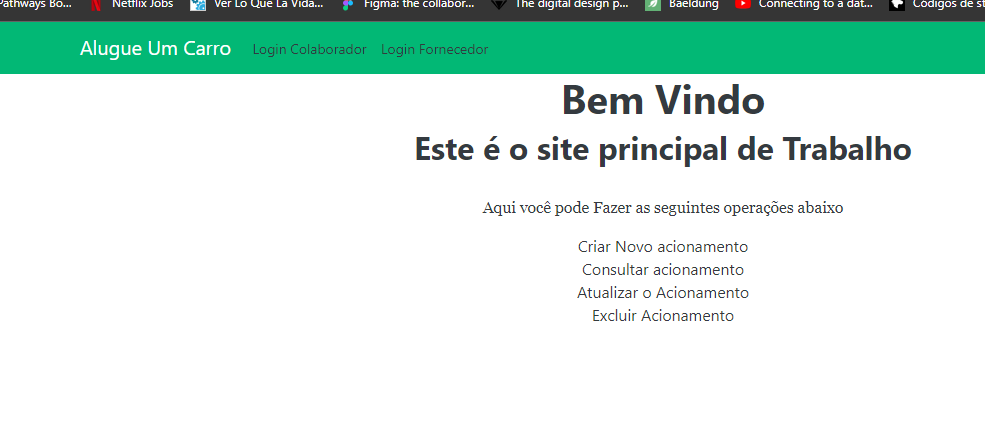
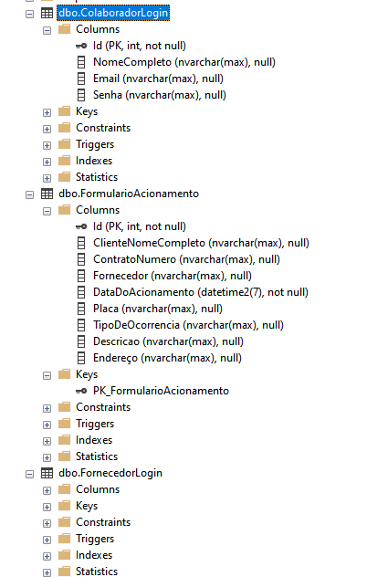
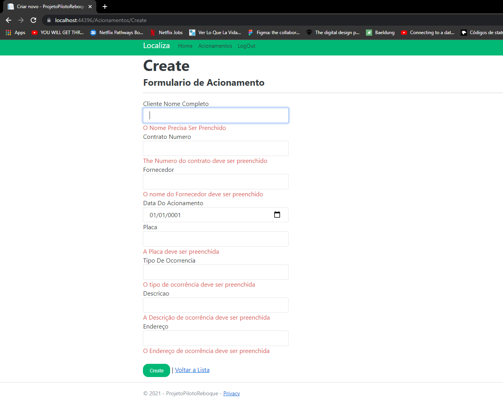
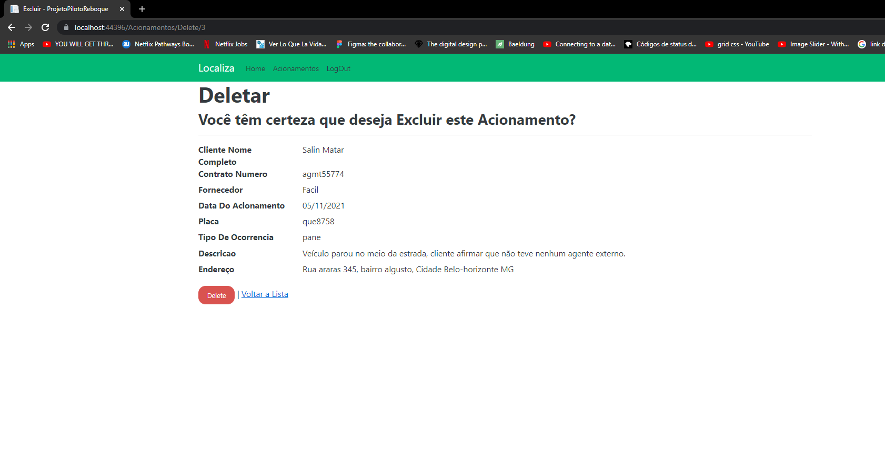

# ASPNET Core MVC 5 - Crud Cadastro de Acionamento de Reboque Versão BETA.

projeto básico de Cadastro de Acionamentos de remoção de veículo prototipo Usando como referência
 o sistema de acionamento de reboque (CRUD), Usando Login Basico, 
com funcionarios já cadastrados no banco, sem possibilidade de acessar o sistema de cadastro
de Login sem que esteja Logado.

<br />
<br />
serviços utilizadas:
CRUD Scaffolding</br>
SqlServer adaptation and migration</br>
Validation</br>
Asynchronous operations using Tasks (async, await)</br>
</br>
</br>


## 🖼 Screenshot das telas da aplicação <br/>
<p>Tela Inicial</p>
<p>Tela de Login</p>
<br/>
<br/>
<p>Banco de Dados</p>
<br/>
<br/>
<p>Lista de Acionamentos</p>
<br/>
<br/>
<p>formulario Cadastro de Acionamentos Usando Validação
</p>
<br/>
<br/>
<br/>
<p>Excluir Acionamento
</p>
<p>Opção para Deslogar, se caso clicar em deslogar precisaria logan Novamente, 
e a navegação fica restrição apenas para Login, é ainda sem possibilidade de Acessar pela URL
</p>
<br/>
<br/>


<br/>
## 🚀 Tecnologias utilizadas <br/>
<br/>


- C#  asp net<br/>
- SqlServer <br/>
- html e css e um pouco de Javascript <br/>
- Razor <br/>
- entity Framework (ORM)<br/>
- Bootstrap
<br/>

## 🚀 Como usar <br/>

```bash
# no arquivo appsettings.json, na linha:
  
  "ConnectionStrings": {
    "DefaultConnection": "Password=123456;Persist Security Info=True;User ID=sa;Initial Catalog=PilotoReboque.db;Data Source=DESKTOP-PCE1A1P\\SQLEXPRESS;"
     terá que mudar para o Servidor do seu Sql Server ";
# Entrar numa IDE de sua preferência 


```


## Linkedin abaixo

<h4 align="center">
   Feito com Por   <a href="https://www.linkedin.com/in/luiz-carlos-b50693173/" target="_blank"> Luiz Carlos </a>
</h4>

</html>
