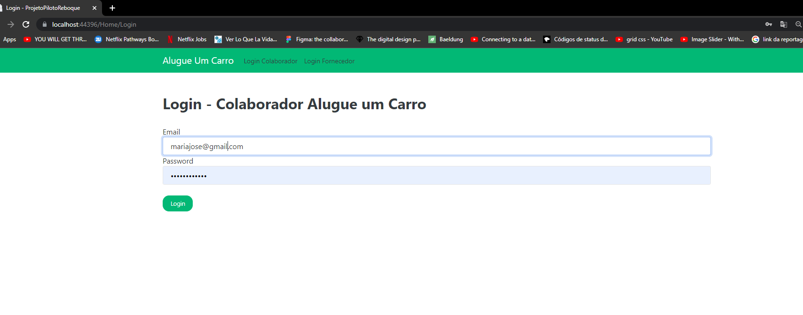

# ASPNET Core MVC 5 - Crud Cadastro de Acionamento de Reboque Versão BETA.

<h3>Description English</h3>
<p>
This project aims to develop a prototype vehicle removal drive registration system, using the trailer drive system (CRUD) as a reference. To guarantee the security and reliability of the system, a Basic Login will be implemented, with employees previously registered in the database. Only those who are logged in will be able to access the Login registration system. In addition, the system will allow the insertion, updating and deletion of information related to vehicle removal drives, in order to provide an efficient and simplified management of these records. With this project, it will be possible to improve technical skills in programming and databases, in addition to developing technological solutions that meet the demands of the market.
    </p>
    
<h3>Descrição em Português </h3>
<p>Este projeto tem como objetivo o desenvolvimento de um sistema de Cadastro de Acionamentos de remoção de veículo protótipo, utilizando o sistema de acionamento de reboque (CRUD) como referência. Para garantir a segurança e a confiabilidade do sistema, será implementado um Login Básico, com funcionários previamente cadastrados no banco de dados. Somente aqueles que estiverem logados poderão acessar o sistema de cadastro de Login. Além disso, o sistema permitirá a inserção, atualização e exclusão de informações relacionadas aos acionamentos de remoção de veículo, a fim de proporcionar uma gestão eficiente e simplificada desses registros. Com esse projeto, será possível aprimorar as habilidades técnicas em programação e bancos de dados, além de desenvolver soluções tecnológicas que atendam às demandas do mercado. </p>


<br />
<br />
serviços utilizadas:
CRUD Scaffolding</br>
SqlServer adaptation and migration</br>
Validation</br>
Asynchronous operations using Tasks (async, await)</br>
</br>
</br>


## 🖼 Screenshot das telas da aplicação <br/>
<p>Tela Inicial</p>
<p>Tela de Login</p>
<br/>
<br/>
<p>Banco de Dados</p>
<br/>
<br/>
<p>Lista de Acionamentos</p>
<br/>
<br/>
<p>formulario Cadastro de Acionamentos Usando Validação
</p>
<br/>
<br/>
<br/>
<p>Excluir Acionamento
</p>
<p>Opção para Deslogar, se caso clicar em deslogar precisaria logan Novamente, 
e a navegação fica restrição apenas para Login, é ainda sem possibilidade de Acessar pela URL
</p>
<br/>
<br/>


<br/>
## 🚀 Tecnologias utilizadas <br/>
<br/>


- C#  asp net<br/>
- SqlServer <br/>
- html e css e um pouco de Javascript <br/>
- Razor <br/>
- entity Framework (ORM)<br/>
- Bootstrap
<br/>

## 🚀 Como usar <br/>

```bash
# no arquivo appsettings.json, na linha:
  
  "ConnectionStrings": {
    "DefaultConnection": "Password=123456;Persist Security Info=True;User ID=sa;Initial Catalog=PilotoReboque.db;Data Source=DESKTOP-PCE1A1P\\SQLEXPRESS;"
     terá que mudar para o Servidor do seu Sql Server ";
# Entrar numa IDE de sua preferência 


```


## Linkedin abaixo

<h4 align="center">
   Feito com Por   <a href="https://www.linkedin.com/in/luiz-carlos-b50693173/" target="_blank"> Luiz Carlos </a>
</h4>

</html>
